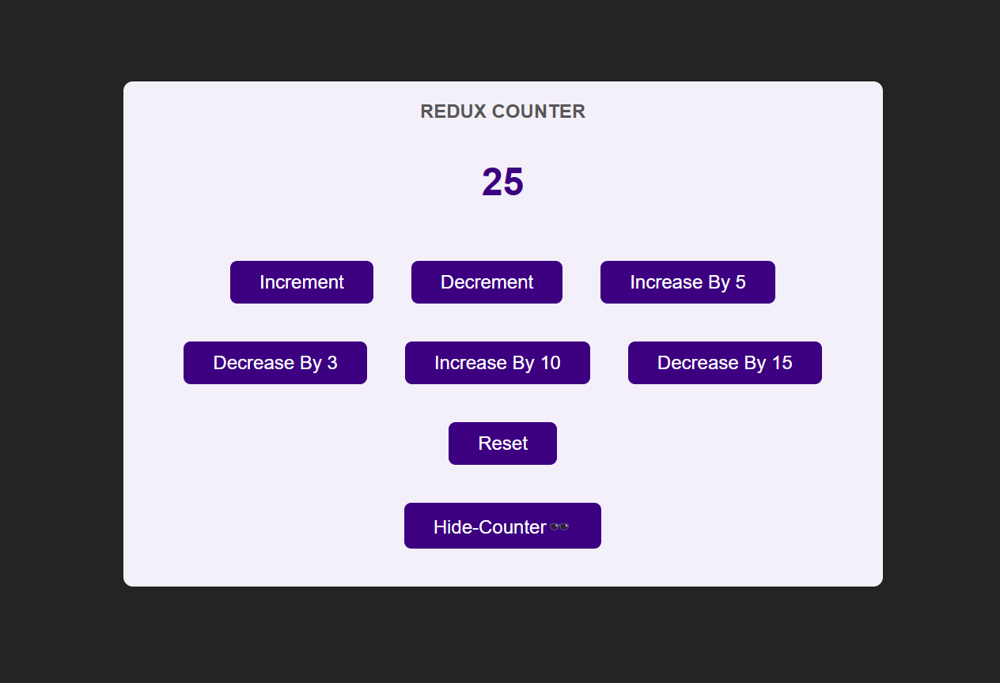
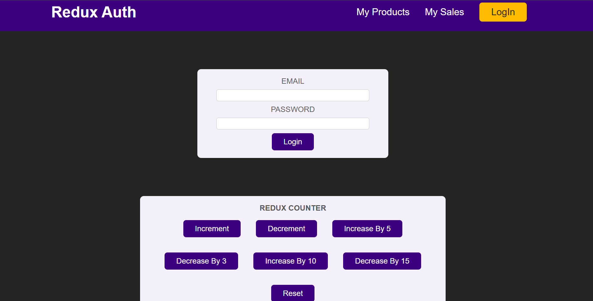

# RTK Basics 👨🏻‍💻⚛️🪝
### **Redux Toolkit (RTK) – Theoretical Overview**

---

### **What is Redux Toolkit?**

Redux Toolkit (RTK) is the **official, recommended approach** for writing Redux logic. It is a **set of tools** and **utilities** designed to simplify Redux development by reducing boilerplate code, improving performance, and enforcing best practices.

RTK was introduced to address some common pain points of Redux, such as **complex setup**, excessive boilerplate, and challenges in handling side effects like API calls.

---

### **Why Use Redux Toolkit?**

While Redux provides a robust state management system, traditional Redux can be verbose and involve repetitive patterns. RTK solves these issues by:
1. **Reducing Boilerplate**: Fewer lines of code compared to vanilla Redux.
2. **Simplified Configuration**: Provides built-in tools to configure the store efficiently.
3. **Opinionated Defaults**: Implements best practices like **immutable state updates** and **state structure** by default.
4. **Improved Developer Experience**: Includes utilities for managing asynchronous code, debugging, and code organization.

---

### **Core Features of Redux Toolkit**

1. **`configureStore`**  
   - A simplified method for setting up the Redux store.  
   - It automatically integrates middleware like **Redux DevTools** and `redux-thunk` for async logic.  
   - Handles common setup tasks, such as combining reducers.

2. **`createSlice`**  
   - The most powerful utility in RTK.  
   - Combines **actions** and **reducers** into a single "slice" of state.  
   - Automatically generates action creators and reducer functions, reducing boilerplate code.

3. **`createAsyncThunk`**  
   - Simplifies handling **asynchronous actions** (e.g., API requests).  
   - Provides lifecycle actions (`pending`, `fulfilled`, `rejected`) for handling loading, success, and error states.

4. **`createReducer`**  
   - A utility to define reducers using the builder pattern or an object syntax.  
   - Supports **mutating syntax** while ensuring **immutability** through libraries like Immer.

5. **`createAction`**  
   - Helps create action objects without writing boilerplate action creator functions.

6. **`RTK Query`**  
   - A powerful **data fetching and caching** tool included with Redux Toolkit.  
   - Simplifies managing server-side data, caching, and invalidation out of the box.

---

### **How Redux Toolkit Differs from Traditional Redux**

| **Feature**               | **Traditional Redux**                 | **Redux Toolkit**                  |
|---------------------------|---------------------------------------|-----------------------------------|
| **Boilerplate**           | Requires a lot of boilerplate (actions, reducers, store setup). | Minimizes boilerplate using `createSlice` and `configureStore`. |
| **Immutable State**       | Developers must manually ensure immutability using `...spread`. | Automatically handled using Immer (can write "mutable" code). |
| **Store Setup**           | Requires combining reducers and middleware manually. | `configureStore` simplifies setup and adds middleware. |
| **Asynchronous Actions**  | Uses `redux-thunk` or `redux-saga` with custom logic. | `createAsyncThunk` simplifies async logic and lifecycle management. |
| **Performance**           | Can be slower due to manual immutability checks. | Optimized by default with Immer and middleware. |
| **Tooling Integration**   | Requires manual setup for Redux DevTools. | Integrated automatically with `configureStore`. |

---

### **Benefits of Redux Toolkit**

1. **Simplified Syntax**: Reduces repetitive and verbose code compared to traditional Redux.
2. **Automatic Immutability**: Allows you to use mutable syntax while ensuring state immutability via Immer.
3. **Built-In Async Handling**: `createAsyncThunk` makes managing API calls and side effects straightforward.
4. **Better Structure**: `createSlice` organizes state logic in a modular and readable way.
5. **RTK Query**: A built-in tool for data fetching and caching that replaces the need for third-party libraries.
6. **Improved Developer Experience**: Built-in Redux DevTools, easy debugging, and best practices by default.

---

### **When to Use Redux Toolkit**

1. **Large-Scale Applications**: Apps with complex state logic and shared state across components.
2. **Async Data Fetching**: Projects requiring frequent API calls and caching (using RTK Query).
3. **Simplifying Redux Setup**: Developers who want to avoid boilerplate code and manual configurations.
4. **Improving Maintainability**: Projects where clean, organized, and modular state logic is essential.

---

### **RTK Query: Simplifying Data Fetching**

RTK Query, a part of Redux Toolkit, is a powerful **data fetching and caching library**. It enables developers to:
1. **Fetch** data asynchronously.
2. **Cache** and automatically invalidate data.
3. Manage **loading** and **error states** effortlessly.

It is built on top of Redux and reduces the need for libraries like Axios for data fetching.

---

### **Conclusion**

Redux Toolkit (RTK) is a modern, streamlined approach to Redux development. By minimizing boilerplate, automating best practices, and providing powerful utilities for async logic and data fetching, RTK makes Redux easier, faster, and more developer-friendly. For developers building modern web applications with Redux, RTK is the go-to solution for efficient and scalable state management.
```javascript

//src/index.js
import React from "react";
import ReactDOM from "react-dom/client";
import { Provider } from "react-redux";
import "./index.css";
import App from "./App";
import store from "./store";

const root = ReactDOM.createRoot(document.getElementById("root"));
root.render(
  <Provider store={store}>
    <App />
  </Provider>
);
```
```js
//src/store/index.js
import { configureStore, createSlice } from "@reduxjs/toolkit";

const initialCounterState = {
  counter: 0,
  showCounter: false,
};

const counterSlice = createSlice({
  name: "counter",
  initialState: initialCounterState, //no need if both names are same
  reducers: {
    increment(state) {
      state.counter++; //! internally 'immer' package is used.
    },
    decrement(state) {
      state.counter--;
    },
    reset(state) {
      state.counter = 0;
    },
    increase(state, action) {
      state.counter += action.payload;
    },
    decrease(state, action) {
      state.counter -= action.payload;
    },
    toggle_counter(state) {
      state.showCounter = !state.showCounter;
    },
  },
});

const store = configureStore({
  //reducer- automatically added by createSlice()
  reducer: counterSlice.reducer,
  //also, for multiple reducers => reducer: { counter: counterSlice.reducer },
});

export const counterActions = counterSlice.actions;
export default store;
```
```js
//src/components/Counter.js

import { useDispatch, useSelector } from "react-redux";
import classes from "./Counter.module.css";
import { counterActions } from "../store";

const Counter = () => {
  const counter = useSelector((state) => state.counter);
  const show = useSelector((state) => state.showCounter);
  const dispatch = useDispatch();
  const toggleCounterHandler = () => {
    dispatch(counterActions.toggle_counter());
  };

  return (
    <main className={classes.counter}>
      <h1>Redux Counter</h1>
      {show && <div className={classes.value}>{counter}</div>}

      <div>
        <button onClick={() => dispatch(counterActions.increment())}>
          Increment
        </button>
        <button onClick={() => dispatch(counterActions.decrement())}>
          Decrement
        </button>
        <button
          // {type: SOME_UNIQUE_IDENTIFIER, payload:5}
          onClick={() => dispatch(counterActions.increase(5))}>
          Increase By 5
        </button>
        <button onClick={() => dispatch(dispatch(counterActions.decrease(3)))}>
          Decrease By 3
        </button>
        <button onClick={() => dispatch(counterActions.increase(10))}>
          Increase By 10
        </button>
        <button onClick={() => dispatch(counterActions.decrease(15))}>
          Decrease By 15
        </button>
        <button onClick={() => dispatch(counterActions.reset())}>Reset</button>
      </div>
      <button onClick={toggleCounterHandler}>
        {show ? "Hide-Counter🕶️" : "Show-Counter🔍"}
      </button>
    </main>
  );
};

export default Counter;
```


# Multiple Slices
```js
import { configureStore, createSlice } from "@reduxjs/toolkit";

const initialCounterState = {
  counter: 0,
  showCounter: false,
};

const initialAuthState = {
  isAuthenticated: false,
};

const counterSlice = createSlice({
  name: "counter",
  initialState: initialCounterState, //no need if both names are same
  reducers: {
    increment(state) {
      state.counter++; //! internally 'immer' package is used.
    },
    decrement(state) {
      state.counter--;
    },
    reset(state) {
      state.counter = 0;
    },
    increase(state, action) {
      state.counter += action.payload;
    },
    decrease(state, action) {
      state.counter -= action.payload;
    },
    toggle_counter(state) {
      state.showCounter = !state.showCounter;
    },
  },
});

const authSlice = createSlice({
  name: "auth",
  initialState: initialAuthState,
  reducers: {
    login(state) {
      state.isAuthenticated = true;
    },
    logout(state) {
      state.isAuthenticated = false;
    },
  },
});

const store = configureStore({
  reducer: { counter: counterSlice.reducer, auth: authSlice.reducer },
});

export const counterActions = counterSlice.actions;
export const authActions = authSlice.actions;

export default store;
```

